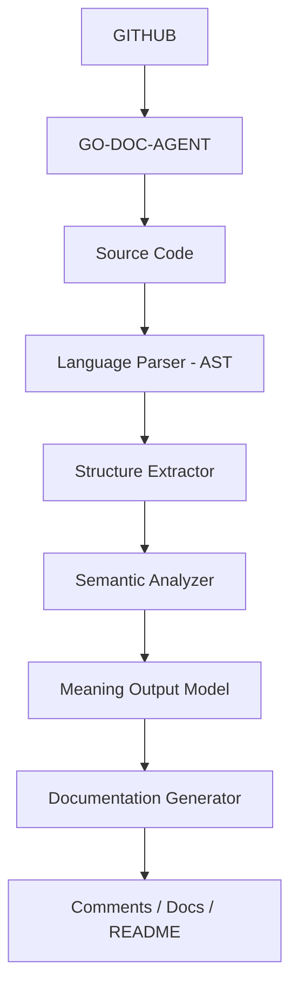

# go-doc-agent 🧠⚙️

**go-doc-agent** is a deterministic documentation engine that analyzes source code structure and meaning to generate consistent, high-quality technical documentation directly from the source itself.

Built for engineers who care about **clarity, scalability, and systems that remain understandable as they grow**.

---

## 🚀 What is this?

A modular, language-oriented documentation system that:

- Parses source code using Abstract Syntax Trees (AST)
- Extracts structural and semantic information
- Understands architectural intent
- Generates professional documentation automatically
- Keeps comments and documentation aligned with real code behavior

No manual comments.  
No outdated README files.  
No tribal knowledge.

---

## 🎯 Why this exists

Most large systems don’t fail because of bad code.

They fail because:

- Documentation becomes obsolete  
- Architectural knowledge lives only in people  
- Codebases grow faster than understanding  

**go-doc-agent** was created to close this gap.

Documentation is treated as a **derivative of the source code**, not as a parallel artifact that inevitably decays over time.

If the code changes, the documentation changes with it.

---

## 🧠 What this system actually does

Instead of generating documentation from templates or heuristics, the engine builds an internal understanding model of the codebase.

It answers questions like:

- What does this component represent?
- What architectural role does it play?
- Which layer does it belong to?
- What are its dependencies?
- What problem does it exist to solve?

Only after understanding these concepts does the system generate documentation.

---

## 🧩 High-level architecture

Each stage has a single responsibility and can evolve independently.

---

## ⚙️ Core design principles

- **AST-based parsing** — no regex, no brittle text matching  
- **Language adapters** — each language owns its syntax logic  
- **Language-agnostic semantic core** — meaning is universal  
- **Strict separation of concerns**  
- **Deterministic behavior**  
- **Offline-first execution**  
- **AI-optional architecture**

AI can enhance the system — **never replace it**.

---

## 🧠 What makes it different

Most documentation tools are:

- template-driven  
- tightly coupled to a single language  
- fragile at scale  

**go-doc-agent is built as an engine, not a script.**

It is designed to support:

- multi-language expansion  
- multiple documentation strategies  
- different output formats  
- static analysis pipelines  
- optional local or cloud AI models  

Without rewriting the core system.

---

## 🧪 Real-world use case

> A company with hundreds of microservices and inconsistent documentation can automatically generate standardized comments and README files directly from the source code.

Documentation becomes:

- reproducible  
- auditable  
- version-controlled  
- architecture-aware  

No manual enforcement required.

---

## 🛠 Tech Stack

- Go (core engine)
- Native AST parsing
- Modular internal architecture
- CLI-oriented execution model
- Optional LLM integration (future)

---

## 📌 Roadmap

- [x] Project directory scanner  
- [x] Language detection layer  
- [x] Unified context model  
- [x] Go AST parser  
- [x] Semantic analyzer foundation  
- [ ] Meaning output model  
- [ ] Comment writer engine  
- [ ] README generator  
- [ ] CLI interface  
- [ ] Multi-language adapters  
- [ ] Local LLM integration  

---

## ⚠️ Important

This tool can modify source files.

Always use version control before execution.

---

## 🧭 Philosophy

> **Systems should explain themselves.**

Documentation should not rely on memory, discipline, or hero developers.

It should be **derived from truth — the code itself**.

---

Built with engineering discipline  
and a deep distrust of systems that collapse under complexity.
