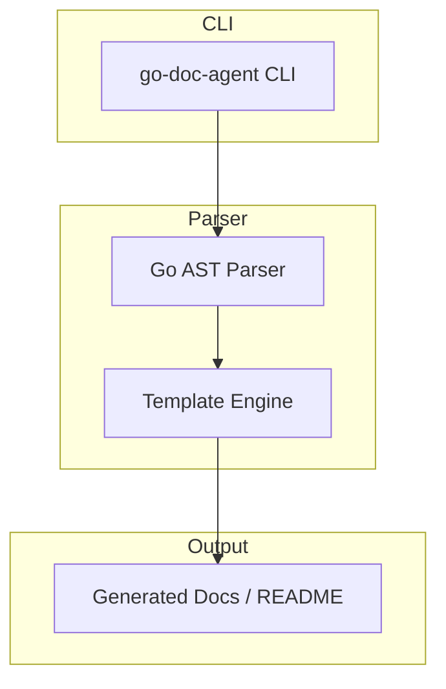

[](https://github.com/amonvix/go-doc-agent/actions/workflows/ci.yml)
[](https://golang.org)

# go-doc-agent 🧠⚙️

Motor determinístico de documentação para gerar comentários no estilo GoDoc e READMEs estruturados diretamente a partir do código-fonte.

**go-doc-agent** analisa a estrutura e o significado do código para gerar documentação técnica consistente e reproduzível diretamente a partir da fonte.

Feito para engenheiros que se importam com **clareza, escalabilidade e sistemas que permanecem compreensíveis à medida que crescem**.

Transforme código em documentação confiável — consistente, reprodutível e fácil de manter conforme o código evolui.

---

## 🚀 O que é isso?

Um sistema modular e orientado a linguagem que:

- Faz parse do código-fonte usando AST (Abstract Syntax Tree)
- Extrai informações estruturais e semânticas
- Entende a intenção arquitetural
- Gera documentação profissional automaticamente
- Mantém comentários e documentação alinhados com o comportamento real do código

Sem comentários manuais.  
Sem README desatualizado.  
Sem conhecimento tribal.

---

## 🎯 Por que isso existe?

A maioria dos sistemas grandes não falha por código ruim.

Eles falham porque:

- A documentação fica obsoleta
- O conhecimento arquitetural fica só na cabeça das pessoas
- O código cresce mais rápido que o entendimento

O **go-doc-agent** existe para fechar essa lacuna.

Aqui, a documentação é tratada como um **derivado do código-fonte**, não como um artefato paralelo que inevitavelmente apodrece com o tempo.

Se o código muda, a documentação muda junto.

---

## 🚀 Usage

```bash
go-doc-agent parse \
  --input ./examples/simple.go \
  --output ./docs/example.md
```

---

## 🧠 What this system actually does

Instead of generating documentation from templates or heuristics, the engine builds an internal understanding model of the codebase.

It answers questions like:

- What does this component represent?
- What architectural role does it play?
- Which layer does it belong to?
- What are its dependencies?
- What problem does it exist to solve?

Only after understanding these concepts does the system generate documentation.

---

## 🧩 High-level architecture



Each stage has a single responsibility and can evolve independently.

---

## ⚙️ Core design principles

- **AST-based parsing** — no regex, no brittle text matching
- **Language adapters** — each language owns its syntax logic
- **Language-agnostic semantic core** — meaning is universal
- **Strict separation of concerns**
- **Deterministic behavior**
- **Offline-first execution**
- **AI-optional architecture**

AI can enhance the system — **never replace it**.

---

## 🧠 What makes it different

Most documentation tools are:

- template-driven
- tightly coupled to a single language
- fragile at scale

**go-doc-agent is built as an engine, not a script.**

It is designed to support:

- multi-language expansion
- multiple documentation strategies
- different output formats
- static analysis pipelines
- optional local or cloud AI models

Without rewriting the core system.

---

## 🧪 Real-world use case

> A company with hundreds of microservices and inconsistent documentation can automatically generate standardized comments and README files directly from the source code.

Documentation becomes:

- reproducible
- auditable
- version-controlled
- architecture-aware

No manual enforcement required.

---

## 🛠 Tech Stack

- Go (core engine)
- Native AST parsing
- Modular internal architecture
- CLI-oriented execution model
- Optional LLM integration (future)

---

## 📌 Roadmap

- [x] Project directory scanner
- [x] Language detection layer
- [x] Unified context model
- [x] Go AST parser
- [x] Semantic analyzer foundation
- [ ] Meaning output model
- [x] Comment writer engine
- [x] README generator
- [x] CLI interface
- [ ] Multi-language adapters
- [ ] Local LLM integration

---

## ⚠️ Important

This tool can modify source files.

Always use version control before execution.

---

## 🧭 Philosophy

> **Systems should explain themselves.**

Documentation should not rely on memory, discipline, or hero developers.

It should be **derived from truth — the code itself**.

---

Built with engineering discipline  
and a deep distrust of systems that collapse under complexity.
